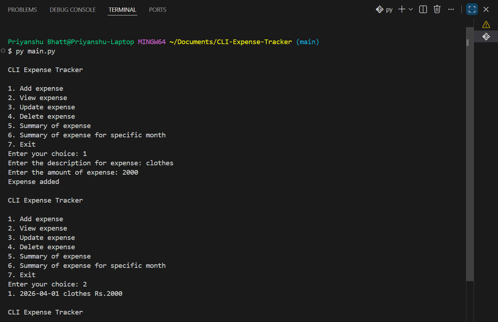

**Project URL:** - https://roadmap.sh/projects/expense-tracker

## CLI Expense Tracker
About the Project

1. This is a simple Command Line Expense Tracker made using Python.
2. You can add expenses, update expenses, change status, and delete expenses.
3. All expenses are stored in a JSON file, so your data is saved even after closing the program.

**This project helped me learn:**

1. Python basics
2. File handling
3. JSON
4. Lists and dictionaries
5. Functions

## Features

The application can:

1. View expenses
2. Add a expense
3. Update expense title
4. Summary of expenses
5. Summary of expense for a specific month
6. Delete expense
7. Save expenses in JSON file

## How to Run the Project
1. Install Python
2. Open terminal
3. Go to project folder
4. Run: python main.py

